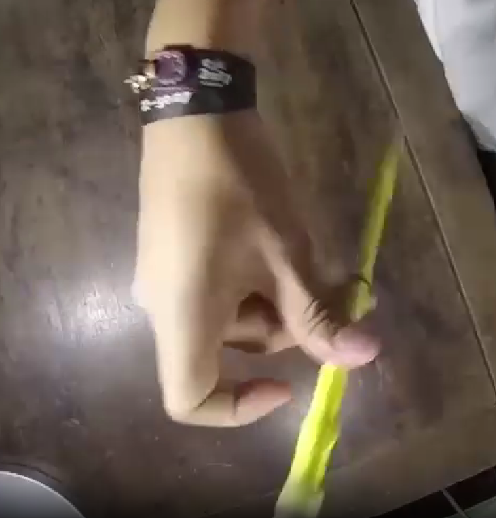
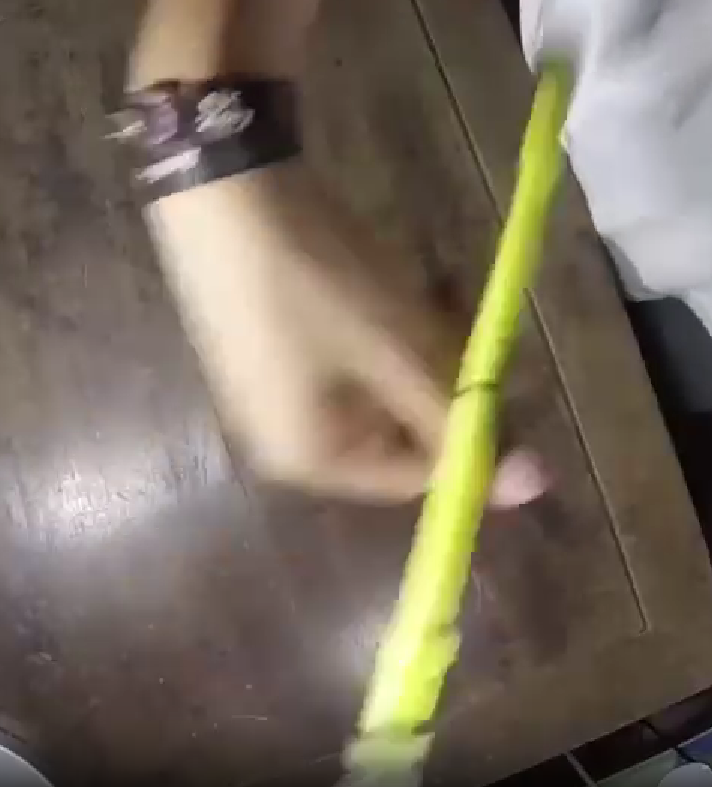
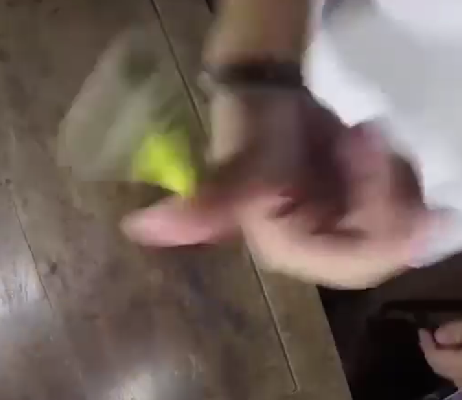
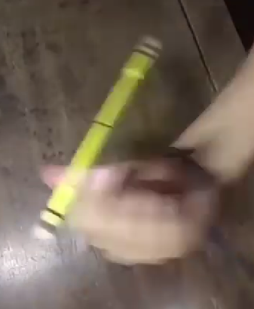

<script setup>
import { VPTeamMembers } from 'vitepress/theme';
import { load } from "/help.js";

const credit = load({ "iracle": "Автор статьи", "art": "Редакция и предоставление материала" });

</script>

# Все про фишинги и фиштейлы

## Введение

Во время моего изучения пс'а, я всегда старался все понять и расставить по полочкам. Фишинги и фиштейлы стали моей первой проблемой и первой темой изучения, почему они такие запутанные? Почему спустя годы после их открытия не появились точные определения? И наконец что вообще такое фишинг, фиштейл, и чем они отличаются.

::: tip Прикольчик
Изначально я не хотел писать публичную статью на эту тему, это должно было быть сообщением в лс Арту для решения вопросов между нами по поводу определений фишингов и фиштейлов. Но информации оказалось настолько много, что я решил сделать более полезную штуку. Да и в споре с Артом я придерживался одного мнения, а к концу статьи вообще все переосмыслил. Дальше - больше\)
:::

*И да, статья расчитана на то что вы имеете базовое представление о псе и его коммюнити*

## Историческая справка

### Фишинг

Вернемся к истокам, 2017 год, начало фишингам дал известный в свое время [Ian Juggler](https://www.youtube.com/@jugglian). Он помимо пс'а активно занимался контактным жонглированием, которое является его основной деятельностью. И как я понял концепция фишинга появилась изначально из контактного жонглирования (*точной инфы я не нашел*). На его канале очень много различных видосов с фишингами, но акцент я сделаю на видео [8 kinds of thumb fishings](https://www.youtube.com/watch?v=SepIEJtIT9c), это первый материал по фишингам который расчитан именно на вариативность. Рассматривается 8 различный вариаций `thumb fishing`'а с разным углом/направлением/хендмувом. Это и послужило триггером на будущие разработки, которые мы рассмотрим по ходу

<video controls="controls" src="./8thumbfishings.mp4" onloadstart="this.volume=0"/>

### Фиштейл

Спустя недолгое время, примерно в тех же временных рамках, небезызвестный псер `Menowa*` на основе концепций фишинга придумывает свой элемент - `fishtail`. Название тут подобрано не просто так, есть аналогичный пс'у вид жонглирования - `Staff spinning`, где крутят полуметровую дубину. Так вот, концепция фиштейла, как и название взяты от туда. Уже на этом моменте развития фиштейла возникали противоречия между фишингами и фиштейлами из-за визуальной похожести

::: info Интересный факт
Менова ввел только идею трюка, название предложил `Kay`, а первый раз записал на видео вообще `Iteza`
:::

<video controls="controls" src="./Fishtail.mp4" onloadstart="this.volume=0.5"/>

### Дальнейшее развитие

Активно фишинги начинает использовать и форсить `i.suk` с 19 года, в его комбе 4'ого раунда `WT19` были линки с фишингами и пд фл араундами, а его экстра комба на `PSO20` почти полностью состояла из них

<video controls="controls" src="./isukpso20.mp4" onloadstart="this.volume=0.5"/>

В настоящее время это все переросло в отдельный тип павера, в котором идеи фишингов и фиштейлов получили большое развитие. `Han nani`, `Uun` и прочие являются яркими представителями такого стиля

## Что же такое фиштейл и фишинг?

### Тамб фишинг

Вероятно вы уже словили передоз от количества 'фишинг' и 'фиштейл' в тексте, когда мы не имеем точных определений этих слов\) Эта историческая инфа нужна была для понимания контекста сложившейся ситуации, но пора уже давать определения и искать смысл

Вернемся к 8 вариациям тамб фишинга которые показывал Ian Juggler, если мы внимательно посмотрим на самый первый линк, то увидим что движение палки можно записать как линк с араундами, где мы сначала делаем обычный ta, а потом засчет изменения положения руки изменяем выполнение араунда, заканчивая уже ta rev.

::: details Примерный алгоритм выполнения выглядит так:
 - Сделать половинку араунда
 - Засчет изменения ориентации руки, зайти на араунд рев
 - Закончить араунд рев
:::

На основе этого можно составить базовую нотацию:

```js
PU-PD thumb fishing = PU ta 0.5 T1-T* ~ PD fl ta rev 0.5 T*-TF
```

::: warning Уточнение
`PU-PD` тут не по приколу, это нотация изменения ориентации руки в рамках одного элемента, в нотации фишингов оно имеет большой смысл, ибо без этого появляется двоякость в понимании.

Также может показаться странным что я указал изначальное положение как `PU`, а не `PS`. На самом деле это не имеет особого значения, ибо в большинстве случаев нотации одного элемента `PU` считается равным `PS`.
:::

По такому принципу можно нотатировать первые 4 тамб фишинга которые показал Йан:

| Название | Нотация |
| - | - |
| **PU-PD** thumb fishing | **PU** ta 0.5 ~ **PD** fl ta rev 0.5  |
| **PU-PD** thumb fishing rev | **PU** ta rev 0.5 ~ **PD** fl ta 0.5  |
| **PD-PU** thumb fishing | **PD** ta 0.5 ~ **PU** fl ta rev 0.5  |
| **PD-PU** thumb fishing rev | **PD** ta rev 0.5 ~ **PU** fl ta 0.5  |

::: tip
В общем случае не особо важны начальные и конечные слоты. И уточнять каким-либо образом про хендмув нам не надо: знак гибрида `~`, изменение ориентации руки и промежуточный слот `T*` являются необходимой и достаточной информацией, за подробностями можете прочитать руководство по нотациям [тык](../../../notation/index)

И еще записывая трюк как `PU-PD thumb fishing rev`, я имею ввиду ввиду ИМЕННО `PU-PD (thumb fishing rev)` , а не `(PU-PD thumb fishing) rev`. Хоть в данном случае другой вариант более точный, я предпочту записывать такие фишинги именно в таком виде.
:::

Но что по поводу других 4 фишингов от Йана? Тут и начинается самая интересная часть. Сначала попробуем разобраться сами, посмотрев на фишинг под 5 номером в его видео.

<div>
  <figure :class="$style.blocking">
    
    <figcaption>
      1. Сначала мы видим стартер: почти перпендикулярное ta в PS
    </figcaption>
  </figure>

  <figure :class="$style.blocking">
    
    <figcaption>
      2. После 0.5 оборотов ta, рука начинает выворачивается в противоположную сторону
    </figcaption>
  </figure>

  <figure :class="$style.blocking">
    
    <figcaption>
      3. Рука полностью вывернулась, палка начинает тоже перпендикулярный ta rev
    </figcaption>
  </figure>

  <figure :class="$style.blocking">
    
    <figcaption>
      4. Конец после ta rev 0.5, палка попала в слот
    </figcaption>
  </figure>
</div>

Итого мы получаем концепцию полностью схожую! *Ну, почти*

Единственный момент в различии хендмува и ориентации руки. Если в прошлых вариациях мы видели что изменение положения руки происходит только между PD и PU, то в этих вариациях такого явного изменения нет. Пока что я опущую эти 4 вариации, рассмотрим их позже в другом ключе. 

::: warning Важно
В дальнейшем для сокращения я буду писать линки в максимально кратком виде, упуская немного информации и составляя фактически неправильный брейк для лучшего понимания с вашей стороны:

```js
PU-PD thumb fishing = PU ta ~ PD ta rev
```

Еще раз уточню, что эта запись по факту неверная, оба араунда имеют количество оборотов 0.5, а второй араунд должен быть с модификатором `fl`.
Уточню, что проще мою неверную запись воспринимать как "идеальный" фишинг, инерция для которого была задана изначально, то есть начальный араунд тоже выполнен *фингерлесс*:

```js
PU-PD thumb fishing = PU fl ta ~ PD fl ta rev
к первому араунду добавляется модификатор `fl`
```

То есть, это можно назвать просто фл фишингом, да -_-. Смысла этот `fl` особо не меняет, но будет использоваться в статье в дальнейшем.
:::

В итоге, забив на те 4 вариации, можно сделать мини-вывод, что основная концепция фишинга заключается в изменении ориентации руки на противоположный и в линке араунд ~ араунд рев.

::: danger Похоже на правду, да?
Спойлер: нет, это определение вообще ошибочно, и работает только конкретно в нашем случае на примере тамб фишинга. 
:::

Еще возникает чувство что обычные 4 вариации дополняют друг друга. И правда, к примеру `PU-PD thumb fishing` и `PD-PU thumb fishing rev` состоят из одних и тех же элементов, только записаных "наоборот":

```js
PU-PD thumb fishing = PU ta ~ PD ta rev
PD-PU thumb fishing rev = PD ta rev ~ PU ta
```

Точно, начало одного такого фишинга является завершением другого, и наоборот. Это подталкивает на мысли что это на самом деле объеденяется в нечто концептуально большее, ну не может это быть просто какой-то случайностью или мелочью.

Если говорить максимально точно, `PU-PD thumb fishing` и `PD-PU thumb fishing rev` в таком виде не являются точными *противоположностями*, начало одного и конец другого являются хоть и одним трюков, но сами эти фишинги не могут объединяться в одну линку

```js
PU-PD thumb fishing > PD-PU thumb fishing rev = [PU ta ~ PD ta rev] > [PD ta rev ~ PU ta]
```

То что я написал выше - просто какой-то тупой линк связывающий эти два фишинга буквально последовательно, тут нужен другой подход, через гибриды, таким образом мы говорим что конец одного фишинга сразу переходит на начало другого:

```js
PU-PD thumb fishing ~ PD-PU thumb fishing rev = PU ta ~ PD ta rev ~ PU ta
```

::: details Nerd text
  Формула в общем виде таких парных элементов будет:

  ```js
  HX-HY trick ~ HY-HX trick rev
  ```

  Где `HX` и `HY` - противоположные ориентации руки(`PD,PU`), а `trick (rev)` - непосредственно сам `thumb fishing` или его реверс.
:::

Да, это именно то что мы и искали. Такие пары можно составить для всех 8 элементов:

| Название | Альтернатива |
| - | - |
| **PU-PD** thumb fishing ~ **PD-PU** thumb fishing rev | **PD-PU** thumb fishing rev ~ **PU-PD** thumb fishing |
| **PD-PU** thumb fishing ~ **PU-PD** thumb fishing rev | **PU-PD** thumb fishing rev ~ **PD-PU** thumb fishing |

::: info Деление
  Я разбил эти пары на два столбика, потому что выходит всего 2 уникальных линки. "Аналогичные" имеют такой же смысл, меняется лишь начальная и конечная ориентация руки:

  ```js
  PU-PD thumb fishing ~ PD-PU thumb fishing rev = PU ta ~ PD ta rev ~ PU ta
  PD-PU thumb fishing rev ~ PU-PD thumb fishing = PD ta rev ~ PU ta ~ PD ta rev
  ```

  Это заметно если мы будет контить эту линку, даже брейк будет совпадать в середине. Самые догадливые наверно уже поняли что на такой парный линк фишингов можно смотреть как на простое чередование `ta` и `ta rev` с разным положением руки. И поэтому не важно как он начинается
:::

Конт... Как же будет выглядить конт такой парной линки?

<figure :class="$style.normaling">
  <video controls="controls" src="./ThumbFF.mp4" onloadstart="this.volume=0.5"/>
  <figcaption>
    [ PU-PD thumb fishing ~ PD-PU thumb fishing rev ] cont by art
  </figcaption>
</figure>

Ничего не напоминает? Да и не суть, можно двигаться дальше. Теперь можно подумать как обобщить концепцию фишинга на другие слоты/пальцы.

### Индекс фишинг

если сделать это напрямую с индексом, то получится что-то вроде:

```js
PU-PD index fishing = PU ia 0.5 ~ PD fl ia rev 0.5
```

Это имеет определенный смысл, и вы даже можете спокойно сделать этот линк, и это будет считаться линком из семейства фишингов, но... Это будет не **индекс** фишингом... Но почему? Мы же сделали то же что и тамбом, что не так? Это один из самых тонких и неточных моментов в нотации, и это надо понять.

Итак, индекс фишинг определяется как:

```js
PD index fishing = PD index bust 0.5 ~ fl ia rev 0.5
```

<figure :class="$style.normaling">
  <video controls="controls" src="./IndexFishing.mp4" onloadstart="this.volume=0.5"/>
  <figcaption>
    index fishing by art
  </figcaption>
</figure>

Вопросов еще больше, разве мы не определили концепцию фишинга посредством араунд на араунд рев с хендмувом? Тут не то что направление у трюков одинаковое, но даже изменения ориентации руки нет. Каким хуем это фишинг?

Может проблема лишь в нотации? Может та странная нотация индекс фишинга просто записана в "кривом" виде? Ну, попробуем это доказать используя наше определение тамб фишинга:

```js
PU-PD thumb fishing = PU ta 0.5 ~ PD fl ta rev 0.5
```

Мы можем сделать равносильный переход связанный с первым араундом:

```js
thumbaround ≈ thumb bust

PU-PD thumb fishing = PU thumb bust 0.5 ~ PD fl ta rev 0.5
```

::: details Почему?
Сначала факт того что ta и баст от тамба не особо отличаются может показаться странным, но на самом деле все очень просто, все *обычные* араунды выполняются с перпендикулярным движением палки, а все басты немного под углом. Но из-за специфического положения большого пальца, араунд именно от него является угловым. Но это не всегда так. Если захотеть, то можно сделать чистый перпендикулярный араунд, просто так уж сложилось что `thumb around` включает в себя эти 2 аспекта выполнения.

На самом деле логика и соответствие бастов и араундов абсолютно нетривиальна, даже удтверждение `thumbaround ≈ thumb bust` имеет смысл конкретно в нашем случае, поэтому я и поставил знак "примерно равно", не буду полностью раскрывать эту тему, она для отдельной статьи😈
:::

Нотация уже выглядит похоже, но эта все так же линка, и изменение ориентации руки по прежнему есть, а в случае индекс фишинга его нет, определенная нами основная концепция все равно теряется😭.

*На самом деле нет, мы все сделали правильно:*

```js
PD index bust 0.5 ~ PD fl ia rev 0.5 = PU ia 0.5 ~ PD fl ia rev 0.5
```

Эти линки несут в себе примерно одинаковый смысл, проблема лишь в той самой нетривиальности и похожести обычных араундов и бастов. В случае линков выше - их можно смело приравнять, `PD index bust 0.5` и `PU ia 0.5` будут указывать на один маленикий аспект выполнения - с явным хендмувом и без него.

*Маленький аспект?* Разве мы не обозначили смену ориентации руки как одну из главных состовляющих фишинга?

### Суть

Увы, но то определение для фишинга которое было дано ранее - неправильное. Это оказалось лишь посредственным ответом, который лишь немного затрагивал саму *суть* фишигов. Сутью я называю общую идею трюка, и прошлое определение на самом деле было лишь частным случаем сути фишинга. Пора уже точно определить что определяет фишинг.

На самом деле суть фишинга состоит в фингерлесс изменении угла вращения палки, в основном посредством изменения ориентации/угла руки. Зачастую 2 гибридных трюка которые идут после и перед хендмува - вариации араундов. Это абстрактное определение которые сложно записать в общем виде на языке нотаций, и это нормально. Современный пс как раз и изучает такие вещи. `Skipped charge` АКА `Japanese motion` тоже пример идеи которую не записать в общем виде.

Такое абстрактное определение дает нам сотни и тысячи возможных линков относящихся к фишингам, и тамб, и индекс фишинги лишь одни из них. Отличаются они тем, что в тамб фишинге угол изменяется засчет явного противоположного хендмува, а в индекс фишинге движение руки и палки более угловатые.

*Так если фишинг это просто идея на основе которой можно придумать сотни элементом, то как мы можем называть отдельный трюк - просто фишингом?*

::: info
Meh, это опять тонкий момент в нотации, так уж сложилось что в целом `fishing` - имеет целых **3** значения:
 - Общая идея про которую было сказано
 - `(Thumb) fishing` - конкретный трюк который так назвали еще до вывода общей сути фишингов
 - `(index/midde/ring/pinky) fishing` - та же история что и тамб фишингом, но эти трюки немного от него отличаются посредством неявного хендмува(что и было рассмотренно на примере индекс/тамб фишинга)

В дальнейшем я буду по аналогии использовать слово 'фишинг' в нескольких значениях для удобства, по контексту все будет понятно.
:::

Это определение фишинга как идеи уже является абсолютно верным, и мы его можем спокойно использовать его для дальнейших рассуждений. С фишингами мы все решили, что же там по фиштейлам?

### Фишинг -> Фиштейл?

До этого мы рассматривали парные линки с тамб фишингами, что же нам мешает обобщить их на другие пальцы тоже? Да ничего не мешает, возьмем самый простой случай утчитывая особенности инд фишинга:

```js
index fishing = index bust ~ ia rev

index fishing [pair linkage] = index bust ~ ia rev ~ index bust
```

::: danger Примечание
Я опять использую сокращенную нотацию по аналогии с тамб фишингами, а так же опускаю запись этой линки с инд фишингом в целом.
В точности сокращенный брейк будет выглядеть как `index fishing ~ mirr index fishing rev`, но для того что бы понять эту запись нужно знать логику `mirr trick rev`, а также нетривиальные басты про которые я писал раньше.

Главное что вы должны понять - важен не сам брейк этой фиговины, а сама линка `index bust ~ fl ia rev ~ index bust`
:::

Эта линка в `PD` конечно не оч возможна, но в `PS`/`PU` её можно выполнить легко, а если выполним получится:

<video controls="controls" src="./Fishtail.mp4" onloadstart="this.volume=0.5"/>

Получиться фиштейл?! Ну, да, оказывается принцип фиштейла основан именно на фишингах. Да вот знать бы каким образом он определяется, и что конкретно можно называть фиштейлом.

Вспомним те 4 вариации тамб фишинга от Йана, оказывается они аналогично индекс фишингу имеют неявное изменение ориентации руки. И с ними тоже получаются парные линки, которые тоже приравниваются к фиштейлу, но на тамбе:

<figure :class="$style.normaling">
  <video controls="controls" src="./TFishtailRev.mp4" onloadstart="this.volume=0.5"/>
  <figcaption>
    thumb fishtail rev cont by art
  </figcaption>
</figure>

::: details Брейк фиштейла
Вариантов брейка/нотации фиштейла существует очень много, но ни один из них не является понятным, и не выражается в базовых элементах( Поэтому я его тут не распишу

В целом пофиг, точный брейк особо и не нужен ¯\\\_(ツ)\_/¯
:::

## Варианты различия концепций

Мы на текущий момент полностью разобрались с фишингами, и чуть-чуть дотронулись до понятия фиштейла. Почему с фиштейлом мы закончили? Потому что... У него нет определения... Да, как бы странно это не звучало, точно установленых комьюнити пс'а границ/определений фиштейла - нет. Я в свое время в это не поверил и перерыл все что мог, но точного ничего не нашел. 

Но на основе моих поисков я нашел и структурировал 2 главные теориии фиштейла/фишинга. Я их взял не из головы: каждая из них высказывалась ранее. Но каждая из этих двух теорий в итоге была заигнорена в ноль😠

*Каждая из этих двух теорий логична и имеет право на существование*

*Плюсы и минусы каждой рассмотрю потом*

### Теория 1: "Олд"

Я условно назвал её так, ибо её подразумевали все с самого начала появления фишингов/фиштейлов.

Она не только определяет понятие фиштейла, но и немного корректирует понятие фишинга.

Так вот:

::: info Теория
Фишинг - фингерлесс изменение угла вращения палки, хендмувами с `PD` и `PU` 

(Упрощенное: вариация линков араунд ~ араунд рев только в `PD`/`PU`)

Фиштейл - фингерлесс изменение угла вращения палки, с неявным хендмувом в `PS`
:::

Эта теория проводит тонкую грань между фишингами/фиштейлами связанную с положениями руки, т.е вся подобная концепция в явном `PU`/`PD` - фишинг, а в `PS` - фиштейл.

### Теория 2: "Модерн"

По аналогии с прошлой теорией, я её решил назвать так, ибо она лучше соответствует современным реалиям пс'а и в целом позже появилась.

::: info Теория
Фишинг - любое фингерлесс изменение угла вращения палки.

Фиштейл - линк из фишингов, подразумевающий их парную связь(???).
:::

Вторая формулировка может быть не совсем понятна, но это как раз те парные линки фишингов на которые я рассматривал ранее. 

Еще эта теория развила идею абстрактного брейка фишинга/фиштейла, а именно то самое `фингерлесс изменение угла палки` можно записывать просто как `fl charge rev` в анстейбл слотах, с технической точки зрения такой брейк лучше всего подходит для описания главной логики, но на практике записывать линки с араундами куда понятнее.

::: warning Про fl charge'ы
Это определение через `fl charge` очень удобно указывает на разницу между фишингами и фиштейлами. Фишингом является любой элемент подобный `fl charge rev 0.5` в любом анстейбл слоте. И правда, на движение фишинга удобно смотреть как на чардж ввиду отсудствия перемещения палки и смены угла вращения. 

Но такая запись имеет смысл только в понимании сути, по факту такое определение через фл чардж не будет работать для записи конкретных трюков - в совменной нотации нет инструментов для уточнения угла вращения палки. *Да и обычные линки с араундами понятнее в разы*

Фишинги будет сложно записать через такие фл чарджи, но с фиштейлом все проще. Он будет записываться как полный фл чардж `fl charge rev (1.0)`, логично что фл чардж на 1.0 оборот будет состоять из двух фл чарджей на 0.5 оборота. Как и фиштейл состоит из двух парных фишингов.
Самая простейшая вариация фиштейла нормал будет записываться как `fl charge rev 1*`.
:::

Основу этой теории я вычитал из видео `Hubik`'а про анализ/тутор фиштейла [*клик*](https://www.youtube.com/watch?v=Srt3rpCPZ9g).

::: details TLDR 
В видео он странно, но верно определяет смысл фиштейла по второй теории(зачем-то все усложняя, даже вводя систему координат для описания движений палки), попутно делая тутор на него, и рассуждает о похожих трюках. Советую глянуть видос для общего развития
:::

### Разногласия

Для этих друх теорий по разному принципу определены фиштейлы.

В первой теории на разделение фишингов/фиштейлов влияет только ориентация руки.

Во второй **любая** парная линка из друх *противоположных* фишингов будет считатся фиштейлом, не только неявные `PS` версии.

<figure :class="$style.normaling">
  <video controls="controls" src="./ThumbFF.mp4" onloadstart="this.volume=0.5"/>
  <figcaption>
    Вот пример парной линки из фишингов, которая по первой теории не будет считаться фиштейлом.
  </figcaption>
</figure>

Что бы лучше понять в чем каждая теория хуже/лучше, можно проанализировать дочерние от концепции фишинга трюки.

## Дочерние трюки

### bust fishing

Скорее всего этот трюк вам знаком, сейчас его активно форсят в мировой комуне. Точнее форсят только самые распостроненные вариации: `hand bust fishing` и `fist bust fishing`. Отличаются они только исполнением с обычными/согнутыми пальцами соответственно. Но возможны и нспользуются другие вариации с разными пальцами.

<figure :class="$style.normaling">
  <video controls="controls" src="./FistBustFishing.mp4" onloadstart="this.volume=0.5"/>
  <figcaption>
    fist bust fishing x10 by i.suk
  </figcaption>
</figure>

Трюк для интуитивного понимания не особо сложный, но есть свои подводные камни.

На **низком** уровне это значит линку:

```js
bust fishing = (fl) bust > fl fishing
```

Но meh, такой брейк не отражает всей сути трюка, и даже является некорректным. Более детально будет нотатировать это как:

```js
bust fishing = (fl) bust 0.5 x-* > fs 1.0 *-y > fl around rev 0.5 y-*
```
*(x и y - любой бекхенд анстейбл слот вроде `1b*`/`3b4b*`/`B*`, без разницы actually)*


`fs 1.0 *-y` тут может показаться странным, но это просто нотация аериал оборотов палки, и последующее касание со слотом.

Мы можем построить некоторые аналогии с определением фиштейла по 2 теории, ибо по факту это тот самый парный линк из двух фишингов только с аериал оборотами между ними. Тут можно более явно наблюдать эту *парность*: 

На видео айсака видно что палка меняет ось вращения 2 раза(во время хенд баста, и во время араунда рев). Это означает что сам по себе баст фишинг состоит из двух фишингов как и фиштейлы(или по умному содержит в себе 2 фл чарджа)

*Однако фиштейлом это назвать нельзя, хоть это и 2 фл парные линки фишингов, однако гибридятся они не последовательно*

Более детально это расказывает Хьюбик в [*том самом видео*](https://www.youtube.com/watch?v=Srt3rpCPZ9g).

::: info Название
Название у баст фишинга немного контринтуитивное, видел много людей не понимают что это название пошло от прототипа линки `bust > fishing` и думают что *фишинг* это некий модификатор , который делается над *бастом* `[bust] fishing`, что в корне не верно.

А вообще разрабы дауны понапридумывали сложных названий и 100 значений одному фишингу, и теперь разбираться😨
:::

Вот еще материал показывающий насколько много вариаций `bust fishing`'а потенциально существует:

<figure :class="$style.normaling">
  <video controls="controls" src="./BustFishingFall.mp4" onloadstart="this.volume=0.5"/>
  <figcaption>
    [bust fishing > fl around rev] fall by Art
  </figcaption>
</figure>

<figure :class="$style.normaling">
  <video controls="controls" src="./PinkyBustFishing.mp4" onloadstart="this.volume=0"/>
  <figcaption>
    pinky bust fishing cont by i.suk
  </figcaption>
</figure>

<figure :class="$style.normaling">
  <video controls="controls" src="./HandBustThumbFishing.mp4" onloadstart="this.volume=0.5"/>
  <figcaption>
    [hand bust > thumb fishing] x 10 by 82Ops
  </figcaption>
</figure>

Трюк подразумевает линк между любыми двумя такими противоположными по осям фишингами в `PD`.
Один палец, несколько пальцев, вся рука согнуты/разогнуты это не важно. Любой линк который можно записать в простом виде `bust > fishing` *(или точнее `bust > around rev`, хотя все равно неправильная запись)* будет относиться к семейству `bust fishing`'ов

### lever

Вот это неожиданно, трюк который был показан еще в 13 году оказывается тоже содержит элементы фишинга/фиштейла. 

<figure :class="$style.normaling">
  <video controls="controls" src="./lever.mp4" onloadstart="this.volume=0.5"/>
  <figcaption>
    index lever cont
  </figcaption>
</figure>

Примерный брейк левера выглядит как:
```js
index lever = PU/PS index bak ~ ma 0.5
```

Где момент транзишна/гибрида на мид араунд являяется не чем иным как половинкой фиштейла! Т.е. фишингом.

### Backhand fishtail

`Backhand fishtail` АКА `fishtail B*` является скорее не отдельным трюком, а игра с концепцией фиштейла на другие слоты.

<figure :class="$style.normaling">
  <video controls="controls" src="./BackhandFishtail.mp4" onloadstart="this.volume=0.5"/>
  <figcaption>
    backhand fishtail rev by art
  </figcaption>
</figure>

Этот трюк, как и его название является контрпримером 1 теории. *Являясь фиштейлом выполняется в `PD`*

## Итоги

### Теории

Утчитывая все моменты, можно оценить эти две теории на их плюсы и минусы.

1 теория:

```diff
+ Более интуитивно понятная
+ объясняет начальную часть базовых фишингов/фиштейлов
- Не работает под современные реалии с новыми элементами
- Примитивна сама по себе, нет точных/абстрактных определений
```

2 теория:

```diff
+ объясняет абсолютно все связанное с фишингами/фиштейлами
+ Имеет низкоуровневую основу - всему дано точное определение
+ Подкрепляется изученными новыми трюками в той же концепции
- Сложна в понимании
```

До написания статьи я делал вывод что первая теория нахуй не нужна. Да вот только мы тут ручки крутим, а не абстрактной алгеброй занимаемся. Если вы не заинтересованы в развитии идей/линков с фишингами/фиштейлами, то вам первой теории вполне хватит. Из всех ныне изученых штук первая теория объясняет почти все, кроме новомодных фиговин которые появились пару лет назад.

Да и еще позже осознал что нам в псе не нужны громадные, точные определения.

<figure :class="$style.normaling">
  
  <figcaption>
    Мои недавние слова о статье Херенза про скиппед чардж(цитирую сам себя😈)
  </figcaption>
</figure>

Еще я находил один видео материал, который тоже позиционирует себя как познавательный в рамках пс'а, в котором тоже есть инфа про фишинги фиштейлы [*тык*](https://www.youtube.com/watch?v=C0z54rYEZFg). Но смотреть это я блять категорически не советую.

Из главного - чел в самом начале кринжанул и выдал невьебенно ужастное определения фишингам и фиштейлам:

```
фишинг - вариации линки around ~ around rev
фиштейл - вариации линки angled around ~ inv angled around
```

Где англед араунды это просто не перпендикулярные араунды с углом наклона 

*нормальные люди называют их вариациямии `bust`'а или `bak`'а, но видимо наш герой не из таких*

Это определение не просто поверхностное как первая теория, но и в корне неправильное. Не нужно бьть супер умным что бы понять что фишинги тоже выполняются не чистыми перпендикулярными араундами. Мейби если это видео было года так 2018, можно было счесть за еще неиследованную концепцию и попытки придумать хоть что-то. Но это видео вышло в 23 году🥰

*Так то главная тема видео про англед араунды. Собсвенно к этой теме у меня не такие большие претензии, как к тупым определениям фишинга/фиштейла. Но это все равно не оправдывает этот видос*

### Финалочка

*Фух* это был длинный путь. Я думаю что основную тему статьи я уже раскрыл и все объяснил.

Усвойте что такая неявно заданная идея имеет множество реализаций. Как придуманных, так и еще нет, fell free to explore.

*Наверно нужно написать эпичный заверщающий крутой текст типо я сигма. А хотя похуй*

Cкажу только что изначально я недооценил всю сложность сбора материала по фишингам и фиштейлам. Когда даже у рпд в книге написано в сумме строчек 8 максимум по этим трюкам😡. Возможно эта статья даже является первой в мире объясняющая весь этот кринж. Но в любом случае я надеюсь, что если ты дошел до сюда и читаешь этот текст. Надеюсь тебе, читателю, все стало понятно. Сделать эту хуйню с нотациями читаемой было сложной задачей. В любом случае всем удачи и дальшейших свершений!

## Благодарности

<VPTeamMembers size="small" :members="credit" />

<style module>
.blocking {
    padding: 1.5rem;
    display: block;
    width: 300px;
    float: none; /*TODO: Сделать умную системы выравнивания 2x2, сука я в этом фронте нихуя не шарю😭😭😭*/
    margin-top: 2rem;
    margin-left: auto;
    margin-right: auto;
    text-align: center;
}
.normaling {
    display: block;
    margin-top: 2rem;
    margin-left: auto;
    margin-right: auto;
    text-align: center;
}
</style>
