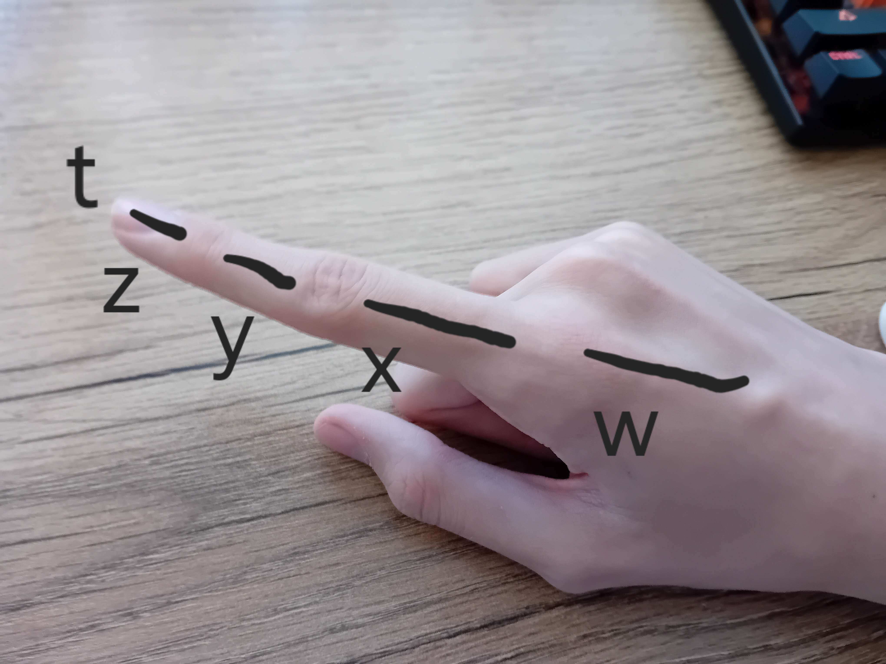
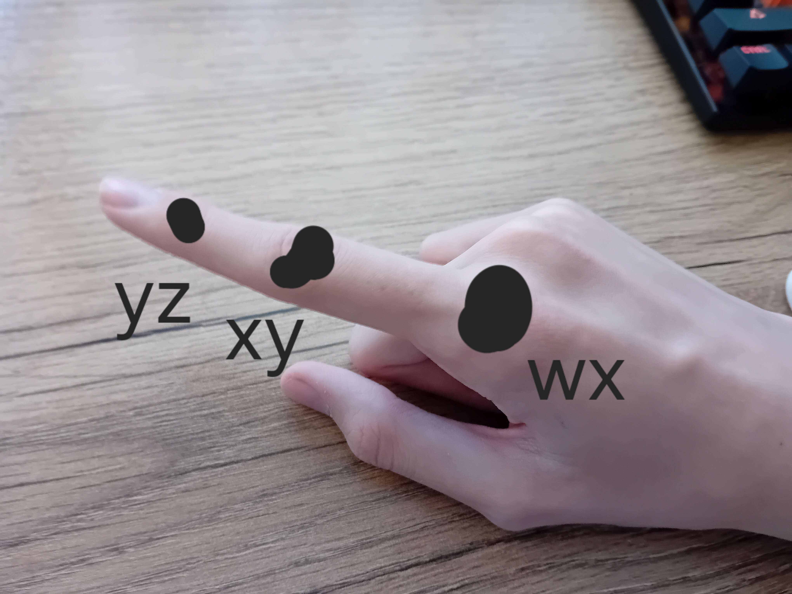
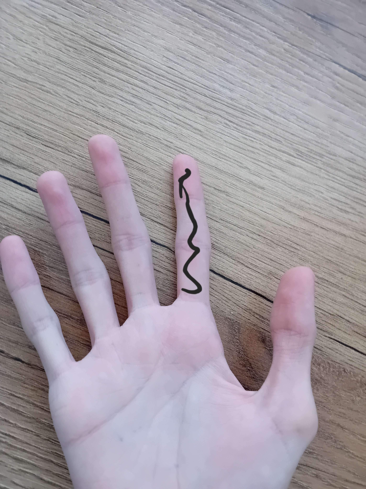
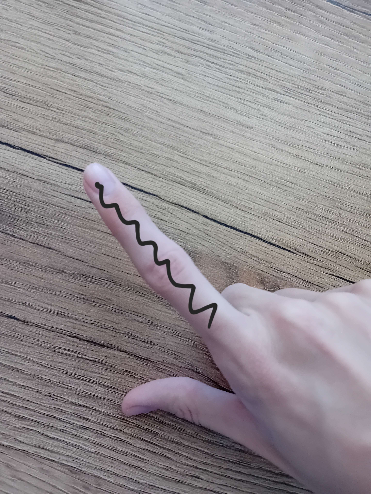
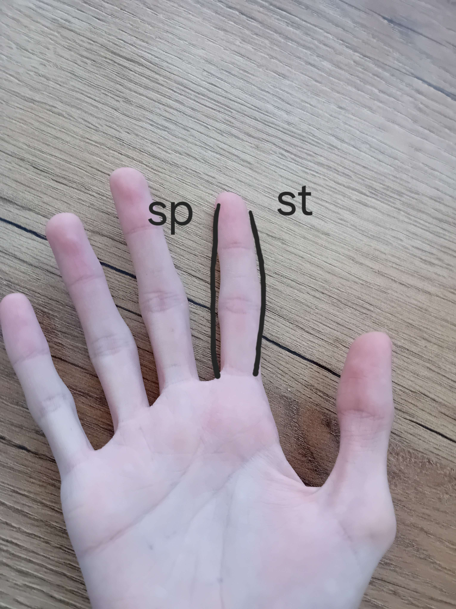

# Нотация фаланг/сторон пальцев

С развитием идей в нашем любимом пс'е, появилась необходимость уточнять конкретные фаланги/стороны пальцев. 

*Твирлы и ин/аут чарджи фел2фарма, курлед трюки, фингеркроссы, много где есть необходимость различать фаланги*

Ну что тут еще говорить, снова люди придумали новые локаторы:

| Обозначение | Русский |
| - | - |
| w | Пястная кость |
| x | Проксимальная фаланга |
| y | Средная фаланга |
| z | Дистальная фаланга |
| t | Кончик пальца |

*На этот раз локаторы фаланг не имеют в себе сокращение названия, а просто являются буквами от `w` до `z`. Исключение: `t`, обозначает слово `tip`(кончик)*

<figure :class="$style.normaling">
  
  <figcaption>
    Расположение этих локаторов фаланг
  </figcaption>
</figure>

Из этого еще вытекает обозначения суставов/пересечений, соединяя локаторы соседних фаланг:

::: info
Анатомически кончик пальца `t` не считается за отдельную фалангу, поэтому обозначение `tz` - не имеет смысла.
И еще фаланга" `w` практически никогда не используется в чистом виде.
:::

| Обозначение | Русский |
| - | - |
| wx | Костяшка пальца |
| xy | Средний сустав |
| yz | Дальний сустав |

<figure :class="$style.normaling">
  
  <figcaption>
    Расположение суставов
  </figcaption>
</figure>

::: tip
Еще есть локатор `k`, который указывает на любой сустав, но используется он максимально редко

*Я не разу не видел его практического использования*
:::

<!--TODO: слоты 1y2y 1z2z 1y2y 12t 1yz2yz-->

Как же ис непосредственно использовать? Ну чтож, условно у нас есть слот `23`, и мы хотим уточнить для держащих пальцев `2` и `3` какими фалангами мы будем держать мод. Для этого после нужного нам пальца, мы пишем необходимую нам фалангу. Если для среднего пальца нам нужно уточнить удержание мода на средней фаланге, мы напишем не просто `2`, а `2y`. Тогда единый слот будет записываться как `2y3`. Если же нам нужно будет уточнить фалангу еще и безымянного пальца, то допишим локатор фаланги уже к ему. `2y3y`/`2y3z` как пример.

В то же время, одних фаланг недостаточно для точной записи абсолютно любого слота. Нужно еще локаторы, показывающие С какой конкретно стороны пальца удерживается мод. Записываются они так же как и фаланги справа от пальца. Тут все еще проще, тк названий меньше:

| Обозначение | Английский | Русский |
| - | - |  - |
| p | palm | Внутренняя сторона |
| b | back | Задняя сторона |
| s | side | Боковая сторона |

::: warning Боковая сторона
Локатор боковой стороны `s` имеет двоякость, тк у пальца есть 2 боковые стороны. Поэтому ввели еще дополнительные обозначения `sp` и `st`, где:
- `sp` (side pinky) - боковая сторона, направленная в сторону мининца
- `st` (side thumb) - боковая сторона, направленная в сторону большого пальца

Логика записи остается такой же.
:::

<div>
  <figure :class="$style.blocking">
    
    <figcaption>
      Внутренняя сторона '1p'
    </figcaption>
  </figure>

  <figure :class="$style.blocking">
    
    <figcaption>
      Задняя сторона сторона '1b'
    </figcaption>
  </figure>

  <figure :class="$style.blocking">
    
    <figcaption>
      Боковые стороны '1s' ('1st'/'1sp')
    </figcaption>
  </figure>
</div>

Практическое использование локаторов:

<!--TODO: слоты Tp1p, Tb1p, Tp1b, 2b2b-->


::: warning Ограничения
Так же как и с обычными локаторами, некоторые комбинации тоже невозможны:
- У большого пальца нет средней фаланги, запись `Ty` - бессмысленна
- Вы не можете разместитьт палку в условных слотах `1w2t`/`1w2w`. Примеров много, но суть одна - такое положение руки человечекси невозможно.
- Удивительно, но вся нотация фаланг/сторон расчитана **только** на пальцы. У вашей ладони нет боковой стороны, а у вашего локтя нет средней фаланги😭.
:::

::: danger Фаланги + Сторона, уточнения
В общем случае запись одного пальца в слоте будет выглядеть как:
```
[локатор пальца][фаланга][сторона]
```

Фаланга и сторона пальца указываются обычно по необходимости, если точность места удержания важно.
:::

<!--TODO: 1ysp2yst example-->

<!--@include: ../../inlineStyle.md-->