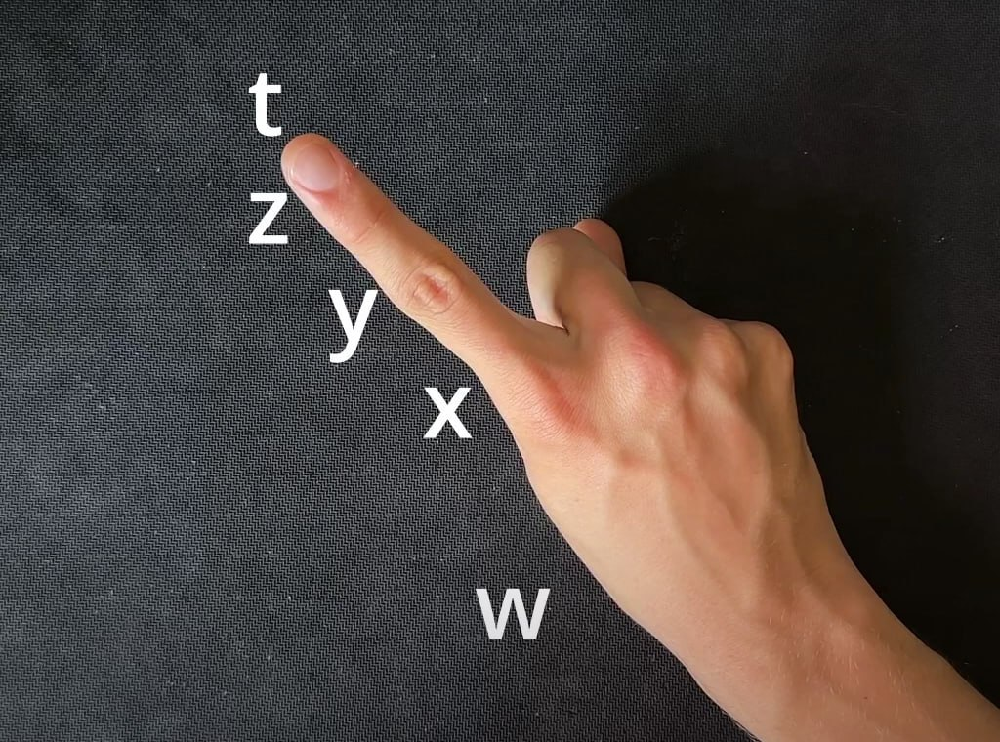

# Нотация фаланг/частей пальцев

С развитием идей в нашем любимом пс'е, появилась необходимость уточнять конкретные фаланги/стороны пальцев. 

*Твирлы ф2ф, курлед трюки, фингеркроссы, много где есть необходимость различать фаланги.*

Ну что тут еще говорить, снова придумали новые локаторы:

| Обозначение | Русский |
| - | - |
| w | Пястная кость |
| x | Проксимальная фаланга |
| y | Средная фаланга |
| z | Дистальная фаланга |
| t | Кончик пальца |

<figure :class="$style.normaling">
  
  <figcaption>
    Расположение этих локаторов фаланг
  </figcaption>
</figure>

Из этого еще вытекает обозначения суставов/пересечений, соединяя локаторы соседних фаланг:

::: info По поводу `t` обозначения.
Анатомически кончик пальца не считается за отдельную фалангу, поэтому обозначение `tz` - не имеет смысла.
И еще "фаланга" `w` практически никогда не используется в чистом виде.
:::

| Обозначение | Русский |
| - | - |
| wx | Костяшка пальца |
| xy | Средний сустав |
| yz | Дальний сустав |

<figure :class="$style.normaling">
  
  <figcaption>
    Расположение всех фаланг/пересечений
  </figcaption>
</figure>

::: tip
Еще есть локатор `k`, который указывает на любой сустав, но используется он максимально редко

*Я не разу не видел его практического использования*
:::

Как же ис непосредственно использовать? Ну чтож, условно у нас есть слот `23`, и мы хотим уточнить для держащих пальцев `2` и `3` какими фалангами мы будем держать мод. Для этого после нужного нам пальца, мы пишем необходимую нам фалангу. Тоесть если для среднего пальца нам нужно уточнить удержание мода на средней фаланге, мы напишем не просто `2`, а `2y`. Тогда единый слот будет записываться как `2y3`. Если же нам нужно будет уточнить фалангу еще и безымянного пальца, то допишим локатор фаланги уже к ему. `2y3y` как пример.

<!--TODO: слоты 1y2y 1z2z 1y2y 12t 1yz2yz-->

Еще появилась необходимость 

<!--@include: ../../inlineStyle.md-->