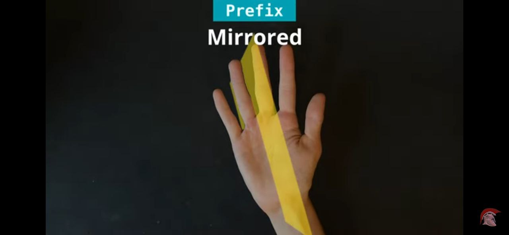
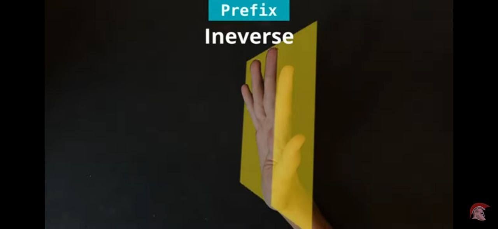
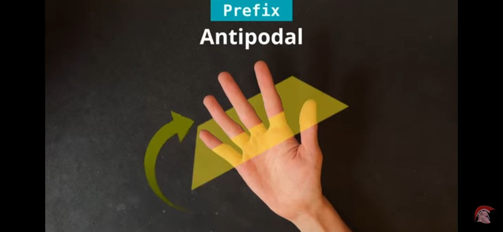

<script setup>
import { VPTeamMembers } from 'vitepress/theme';
import { load, textColor } from "/help.js";
import ColorText from '/.vitepress/theme/components/ColorText.vue';

const credit = load({ "iracle": "Автор статьи", "art": "Редакция и предоставление материала" });

</script>
# Префиксы

Префикс - особый вид модификатора который пишется непосредственно перед названием трюка, и влияет на особенности его исполнения.

*Признаных* существует 15 префикстов:

::: tip Признание
Один из аспектов раннего пс'а - давать тысячи ненужных названий элементам которые будет проще представить как связку. С префиксами по аналогии случилась такая-же фигня. Префиксы подобные `Devil’s`,`Demon’s`, `in/out` раньше активно использовались ввиду плохой основы для нормальной нотации дочерних трюков. Сейчас же все такие префиксы "слились" с названием трюка и больше не существуют как модификаторы.

Да и сейчас есть такие модификаторы которые использовать не рекомендуется, я их помечу звездочкой (`*`);
:::

<!--#88e19d - green-->
<!--#e4e268 - yellow-->
<!--#e46868 - red-->
| Обозначение | Обозначение|
| - | - |
| <ColorText text="inverse" color="#88e19d"/> | <ColorText text="continuous" color="#88e19d"/> |
| <ColorText text="mirrored" color="#e4e268"/> | <ColorText text="moonwalk *" color="#88e19d"/> |
| ~~antipodal~~ |<ColorText text="side *" color="#88e19d"/> |
| <ColorText text="fingerless" color="#88e19d"/> | <ColorText text="isolated *" color="#e46868"/> |
| <ColorText text="tipped" color="#e4e268"/> | <ColorText text="curled" color="#e4e268"/> |
| <ColorText text="counter" color="#88e19d"/> | <ColorText text="palm" color="#e46868"/> |
| <ColorText text="aerial" color="#88e19d"/> | <ColorText text="backhand" color="#e46868"/> |

*цвет соответствует частоте использования*

Теперь по порядку:

## `inverse`/`mirroded`/~~`antipodal`~~

Все эти ~~3~~ 2 модификатора указывают на *отражение* трюка относительно определенной плоскости. Тоесть мы как бы выполняем трюк в зеркале, отражая его. Для каждого названия плоскость отражения своя. *Геометрия, опять думать😭*

*самую лучшую визуализацию плоскостей я украду у [тильта](https://www.youtube.com/watch?v=tvlGCEbp12c)*

<div>
  <figure :class="$style.normaling">
    
    <figcaption>
      Плоскость mirroroed - перпендикулярная ладони, но парралельна пальцам.
    </figcaption>
  </figure>

  <figure :class="$style.normaling">
    
    <figcaption>
      Плоскость inverse - полностью соответствующая/парралельная ладони.
    </figcaption>
  </figure>

  <figure :class="$style.normaling">
    
    <figcaption>
      Плоскость antipodal - перпендикулярная ладони, перпендикулярная пальцам.
    </figcaption>
  </figure>
</div>

::: danger Antipodal
Среди всех модификаторов в целом - `antipodal` самый новый и неизвестный. Был придуман не из-за практической надобности, а как полноценность в идее отражения плоскостей (в нашем трехмерном мире получается 3 плоскости, поэтому должно быть именно 3 модификатора отражающих трюк по соответствующим плоскостям)

Собственно почему я его так выделяю на фоне всех модификаторов - у него литерали нет практического применения (только если вы человек с нормальными руками, и не являетесь частью `fen`'ов).

Для большинства симметричных трюков, он будет просто из трюка превращать его в реверс `antipodal charge = charge rev`, но в других случаях все гибриды с этим модификатором человечески невозможны. Нет ни одного нормального антиподал трюка. Просто забейте на его существование \:/
:::

Точную логику их действия и свойства рассматривать тут не буду, упомяну что `inverse` используется повсеместно, а `mirrored` - уже не так распостранен. В мире обычных соников/пассов он ничего особо не делает, большинство соников симметричны относительно плоскости `mirrored`, и трюк превращается просто в реверс:

```js
mirrored sonic = sonic rev
mirrored twisted sonic = twisted sonic rev
```

Самый яркий пример действия `mirrored` - `mirrored powerpass`. Когда вся логика трюка сохраняется, но он просто направлен в другую сторону. Именно так и должно выглядеть отражение.

<!--TODO: pp/mirpp-->

## `fingerless`

Модификатор указывающий на то, что трюк должен быть сделан без задания инерции пальцами. Должен использоваться предыдущий момент инерци или движение кисти/руки.

Но есть исключения вроде `fl around`'ов, самый простой пример - любой `spread`. Видно 

<!--TODO: pinky spread-->

Видно что движение пальцом явно присутствует, но все же технически это считается как фингерлесс - если движение было сделано тем же пальцом вокруг которого будет сделан араунд. Подробнее я об этом расскажу в другой статье.

<!--@include: ../../inlineStyle.md-->

## `tipped`

Самый мемный из всех модификаторов, но при этом имеющий свою смысловую ценность. Он применяется только к трюкам которые образуют **коническое** движение мода (*все трюки частью которых является чардж*). Смысл его в том, что бы убрать это коническое движение, и оставить только поворот в одной плоскости.

<!--TODO: tipped charge/charge-->

::: info Направление
В типпед трюках становиться немного сложно работать с направлением(точнее такое понятие как *направление* там почти отсутствует), если `charge` и `charge rev` отличаются, то `tipped charge` и `tipped charge rev` обозначают одно и то же. А в случае `tipped sonic` и `tipped sonic rev` - различие будет только в начальных, конечных слотах.
:::

## `counter`

Смысл этого модификатора - выполнение трюка сначала как обычно, а потом его прерывание на реверс того же элемента. Получается такая фингерлесс смена направление засчет двух вариаций одного трюка. С развитием в псе эта идея переросла в целый стиль: `taps and counters`.

<!--TODO: counter-->